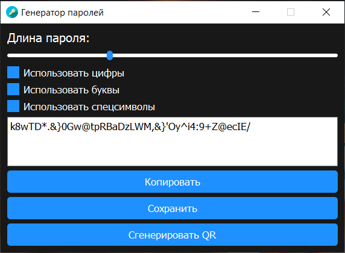

# Генератор паролей на python3 + PyQT5


Это простое приложение генератора паролей, реализованное с использованием PyQt5. Приложение генерирует случайные пароли на основе пользовательских критериев, таких как длина пароля и типы символов. Оно также предоставляет дополнительные функции, такие как копирование сгенерированного пароля в буфер обмена, сохранение пароля в файл и отображение пароля в виде QR-кода.



## Возможности

- Генерация случайных паролей с настраиваемой длиной.
- Возможность выбора включения цифр, букв и специальных символов в сгенерированные пароли.
- Копирование сгенерированного пароля в буфер обмена для удобства использования.
- Сохранение сгенерированного пароля в файл для последующего использования.
- Отображение сгенерированного пароля в виде QR-кода для удобного сканирования.

## Требования

- Python 3.x
- PyQt5
- pyperclip
- qrcode

## Использование

1. Установите требуемые зависимости.

    ```bash
    pip install -r requirements.txt
    ```
2. Запустите файл `main.py`, используя Python.

   ```bash
   python main.py
   ```

3. Откроется окно приложения с различными параметрами для настройки генерации пароля.
4. Используйте ползунок для настройки длины пароля (длина по умолчанию: 8 символов).
5. Установите или снимите флажки, чтобы включить или исключить цифры, буквы и специальные символы.
6. Сгенерированный пароль будет отображаться в текстовом поле.
7. Щелкните кнопку "Копировать", чтобы скопировать пароль в буфер обмена.
8. Щелкните кнопку "Сохранить", чтобы сохранить пароль в файл.
9. Щелкните кнопку "Сгенерировать QR", чтобы отобразить пароль в виде QR-кода.
10. Закройте окно приложения по завершении работы.

## Сборка через PyInstaller
Чтобы собрать готовый билд вам нужно:
1. Установить pyinstaller
    ```bash
   pip install pyinstaller
   ```
2. Запустить сборку
    ```bash
   pyinstaller build.spec
   ```

### Скачать готовый билд под Windows:
[](dist/Password%20Generator.exe)


## Вклад
Буду очень рад если кто-то поможет с фиксом багов и рефакторингом! Если у вас есть предложения или улучшения, пожалуйста, откройте проблему (issue) или отправьте запрос на включение изменений (pull request).

## Лицензия

Этот проект лицензируется на условиях лицензии MIT. Дополнительную информацию можно найти в файле [LICENSE](./LICENSE).